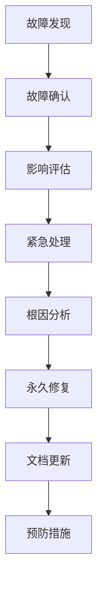

# 智能设备管理系统 - 运维手册

## 📋 运维概述

本手册提供智能设备管理系统的日常运维指导，包括监控、维护、故障处理和性能优化。

## 🔍 系统监控

### 关键指标监控

#### 系统资源监控
```bash
# CPU使用率
top -p $(pgrep -f "smart-device-management")

# 内存使用情况
free -h
ps aux | grep smart-device-management

# 磁盘使用情况
df -h
du -sh /var/log/smart-device-management/

# 网络连接
netstat -tulpn | grep :8080
ss -tulpn | grep :8080
```

#### 应用监控指标
- **响应时间**: API平均响应时间 < 200ms
- **错误率**: HTTP 5xx错误率 < 1%
- **并发连接**: WebSocket并发连接数
- **数据库连接**: 活跃连接数 < 80%最大连接数
- **内存使用**: 应用内存使用 < 80%可用内存

### 监控脚本

```bash
#!/bin/bash
# monitor.sh - 系统监控脚本

LOG_FILE="/var/log/system-monitor.log"
DATE=$(date '+%Y-%m-%d %H:%M:%S')

# 检查服务状态
check_service() {
    local service_name=$1
    local port=$2
    
    if curl -f http://localhost:$port/health &>/dev/null; then
        echo "[$DATE] $service_name: OK" >> $LOG_FILE
        return 0
    else
        echo "[$DATE] $service_name: FAILED" >> $LOG_FILE
        return 1
    fi
}

# 检查后端服务
if ! check_service "Backend" 8080; then
    # 发送告警
    echo "Backend service is down!" | mail -s "Alert: Service Down" admin@company.com
fi

# 检查数据库连接
if ! pg_isready -h localhost -p 5432 &>/dev/null; then
    echo "[$DATE] Database: FAILED" >> $LOG_FILE
    echo "Database is down!" | mail -s "Alert: Database Down" admin@company.com
else
    echo "[$DATE] Database: OK" >> $LOG_FILE
fi

# 检查磁盘空间
DISK_USAGE=$(df / | awk 'NR==2 {print $5}' | sed 's/%//')
if [ $DISK_USAGE -gt 80 ]; then
    echo "[$DATE] Disk usage: ${DISK_USAGE}% - WARNING" >> $LOG_FILE
    echo "Disk usage is ${DISK_USAGE}%" | mail -s "Alert: High Disk Usage" admin@company.com
fi
```

## 🔧 日常维护

### 日志管理

#### 日志轮转配置
```bash
# /etc/logrotate.d/smart-device-management
/var/log/smart-device-management/*.log {
    daily
    rotate 30
    compress
    delaycompress
    missingok
    notifempty
    create 644 app app
    postrotate
        systemctl reload smart-device-management
    endscript
}
```

#### 日志分析
```bash
# 查看错误日志
grep "ERROR" /var/log/smart-device-management/app.log | tail -100

# 分析API响应时间
awk '/API Request/ {print $NF}' /var/log/smart-device-management/app.log | \
    sort -n | awk '{sum+=$1; count++} END {print "Average:", sum/count "ms"}'

# 统计错误类型
grep "ERROR" /var/log/smart-device-management/app.log | \
    awk '{print $5}' | sort | uniq -c | sort -nr
```

### 数据库维护

#### 定期维护任务
```sql
-- 数据库统计信息更新
ANALYZE;

-- 清理过期数据（保留3个月）
DELETE FROM device_logs WHERE created_at < NOW() - INTERVAL '3 months';
DELETE FROM alarm_records WHERE created_at < NOW() - INTERVAL '3 months';

-- 重建索引
REINDEX DATABASE smart_device_management;

-- 检查数据库大小
SELECT 
    schemaname,
    tablename,
    pg_size_pretty(pg_total_relation_size(schemaname||'.'||tablename)) as size
FROM pg_tables 
WHERE schemaname = 'public'
ORDER BY pg_total_relation_size(schemaname||'.'||tablename) DESC;
```

#### 数据库备份验证
```bash
#!/bin/bash
# verify-backup.sh

BACKUP_FILE="/backup/postgres/backup_$(date +%Y%m%d).sql"
TEST_DB="smart_device_management_test"

# 创建测试数据库
createdb $TEST_DB

# 恢复备份到测试数据库
psql $TEST_DB < $BACKUP_FILE

# 验证数据完整性
TABLES_COUNT=$(psql -t -c "SELECT COUNT(*) FROM information_schema.tables WHERE table_schema='public';" $TEST_DB)

if [ $TABLES_COUNT -gt 0 ]; then
    echo "Backup verification: PASSED ($TABLES_COUNT tables restored)"
else
    echo "Backup verification: FAILED"
    exit 1
fi

# 清理测试数据库
dropdb $TEST_DB
```

## 🚨 故障处理

### 常见故障及解决方案

#### 1. 服务无响应
```bash
# 检查进程状态
ps aux | grep smart-device-management

# 检查端口占用
lsof -i :8080

# 重启服务
systemctl restart smart-device-management

# 查看启动日志
journalctl -u smart-device-management -f
```

#### 2. 数据库连接池耗尽
```sql
-- 查看当前连接
SELECT 
    pid,
    usename,
    application_name,
    client_addr,
    state,
    query_start,
    query
FROM pg_stat_activity 
WHERE state = 'active';

-- 终止长时间运行的查询
SELECT pg_terminate_backend(pid) 
FROM pg_stat_activity 
WHERE state = 'active' 
AND query_start < NOW() - INTERVAL '5 minutes';
```

#### 3. 内存泄漏
```bash
# 监控内存使用
watch -n 5 'ps aux | grep smart-device-management | grep -v grep'

# 生成内存dump（Go应用）
curl http://localhost:8080/debug/pprof/heap > heap.prof

# 分析内存使用
go tool pprof heap.prof
```

#### 4. WebSocket连接异常
```bash
# 检查WebSocket连接数
netstat -an | grep :8080 | grep ESTABLISHED | wc -l

# 测试WebSocket连接
wscat -c ws://localhost:8080/ws

# 查看WebSocket相关日志
grep "websocket" /var/log/smart-device-management/app.log
```

### 故障处理流程



## 📈 性能优化

### 数据库优化

#### 索引优化
```sql
-- 分析慢查询
SELECT 
    query,
    calls,
    total_time,
    mean_time,
    rows
FROM pg_stat_statements 
ORDER BY total_time DESC 
LIMIT 10;

-- 创建必要索引
CREATE INDEX CONCURRENTLY idx_device_logs_created_at 
ON device_logs(created_at);

CREATE INDEX CONCURRENTLY idx_devices_status 
ON devices(status) WHERE status != 'active';
```

#### 连接池优化
```go
// 数据库连接池配置
db.SetMaxOpenConns(25)
db.SetMaxIdleConns(5)
db.SetConnMaxLifetime(5 * time.Minute)
```

### 应用优化

#### 缓存策略
```go
// Redis缓存配置
type CacheConfig struct {
    DeviceStatusTTL time.Duration // 设备状态缓存30秒
    UserSessionTTL  time.Duration // 用户会话缓存24小时
    APIResponseTTL  time.Duration // API响应缓存5分钟
}
```

#### WebSocket优化
```go
// WebSocket连接优化
var upgrader = websocket.Upgrader{
    ReadBufferSize:  1024,
    WriteBufferSize: 1024,
    CheckOrigin: func(r *http.Request) bool {
        return true // 生产环境需要严格验证
    },
}
```

## 🔄 更新部署

### 滚动更新流程

```bash
#!/bin/bash
# rolling-update.sh

# 1. 备份当前版本
docker tag current-backend:latest backup-backend:$(date +%Y%m%d)

# 2. 拉取新版本
docker pull new-backend:latest

# 3. 更新后端服务（零停机）
docker-compose up -d --no-deps backend

# 4. 健康检查
sleep 30
if curl -f http://localhost:8080/health; then
    echo "Backend update successful"
else
    echo "Backend update failed, rolling back..."
    docker-compose up -d --no-deps backup-backend
    exit 1
fi

# 5. 更新前端
docker-compose up -d --no-deps frontend
```

### 数据库迁移

```bash
#!/bin/bash
# migrate-database.sh

# 1. 备份数据库
pg_dump smart_device_management > backup_before_migration.sql

# 2. 执行迁移
./smart-device-management migrate up

# 3. 验证迁移
./smart-device-management migrate status
```

## 📊 性能基准

### 基准测试

```bash
# API性能测试
ab -n 1000 -c 10 http://localhost:8080/api/v1/devices

# WebSocket连接测试
node websocket-load-test.js --connections 100 --duration 60

# 数据库性能测试
pgbench -c 10 -j 2 -t 1000 smart_device_management
```

### 性能指标

| 指标 | 目标值 | 告警阈值 |
|------|--------|----------|
| API响应时间 | < 200ms | > 500ms |
| 数据库查询时间 | < 100ms | > 300ms |
| WebSocket连接数 | < 1000 | > 1500 |
| CPU使用率 | < 70% | > 85% |
| 内存使用率 | < 80% | > 90% |
| 磁盘使用率 | < 80% | > 90% |

## 📞 应急联系

### 联系方式
- **技术负责人**: tech-lead@company.com
- **运维团队**: ops@company.com
- **24小时热线**: +86-xxx-xxxx-xxxx

### 升级流程
1. **P0故障**: 立即联系技术负责人
2. **P1故障**: 2小时内联系相关团队
3. **P2故障**: 工作时间内处理
4. **P3故障**: 计划维护时间处理

---

**📝 注意**: 本手册应定期更新，确保与系统实际情况保持一致。
