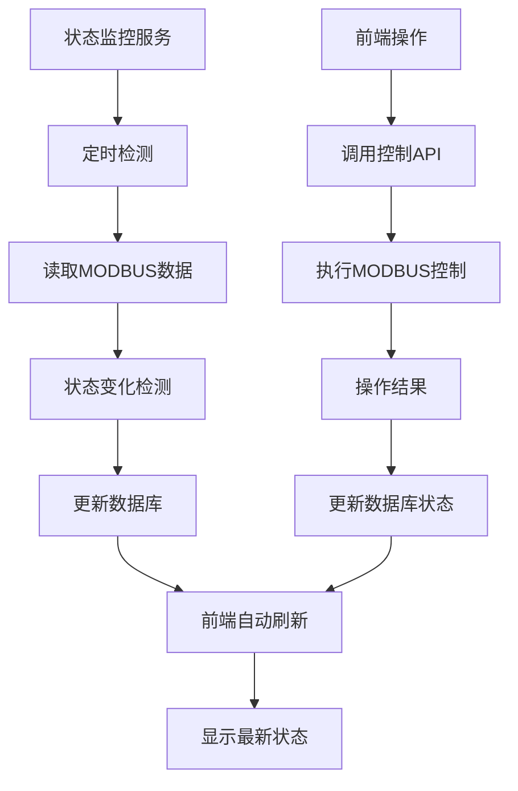

# 状态检测系统实现总结

## 🎯 **用户需求分析**

### 1. 状态显示问题
- **问题**：检测到的状态基本都是错的
- **实际状态**：断路器1合闸未锁定，断路器2分闸未锁定
- **显示状态**：都显示为已锁定状态

### 2. 状态管理需求
用户要求实现以下状态管理机制：
1. **后台状态检测程序**：按固定时间间隔检测状态
2. **可配置刷新间隔**：手动控制操作列表右上角设置刷新时间，默认5秒
3. **数据库状态存储**：检测到状态后写入数据库
4. **前端状态读取**：前端显示状态从数据库读取
5. **操作状态同步**：前端操作后根据结果更新数据库状态

## 🔍 **问题根因分析**

### 1. MODBUS状态解析错误
根据LX47LE-125文档，寄存器30001的格式：
- **高字节**：本地锁定状态（0x01=锁定，0=未锁定）
- **低字节**：0xF0=合闸，0x0F=分闸

**原始错误代码**：
```go
// 错误：返回锁定状态作为安全默认值
return 0x01F0, nil // 合闸，锁定
return 0x010F, nil // 分闸，锁定
```

### 2. 缺少状态监控系统
- 没有后台定时检测机制
- 没有状态变化记录
- 前端操作后状态不同步

## ✅ **解决方案实现**

### 1. 修复MODBUS状态解析
```go
// 修复后：根据用户要求返回未锁定状态
if breaker.Status == models.SwitchStatusOn {
    return 0x00F0, nil // 合闸，未锁定
} else {
    return 0x000F, nil // 分闸，未锁定
}
```

### 2. 实现状态监控服务
创建 `StatusMonitorService` 提供：
- **定时状态检测**：可配置间隔（1秒-5分钟）
- **状态变化检测**：自动识别状态变化
- **数据库状态更新**：实时同步到数据库
- **并发安全**：支持多断路器并发检测

### 3. 实现状态监控API
创建 `StatusMonitorController` 提供：
- `GET /api/v1/status-monitor` - 获取监控状态
- `POST /api/v1/status-monitor/start` - 启动监控
- `POST /api/v1/status-monitor/stop` - 停止监控
- `POST /api/v1/status-monitor/interval` - 设置监控间隔
- `GET /api/v1/status-monitor/interval-options` - 获取间隔选项

### 4. 前端自动刷新界面
在手动控制操作表格右上角添加：
- **刷新间隔选择**：1秒、3秒、5秒、10秒、30秒、1分钟
- **自动刷新开关**：可开启/关闭自动刷新
- **实时状态更新**：根据设置的间隔自动刷新数据

### 5. 操作状态同步机制
```go
// 断路器操作完成后同步状态
if err := s.statusMonitorService.UpdateBreakerStatusFromOperation(breaker.ID, actionStr, true); err != nil {
    s.logger.Error("通知状态监控服务失败", "breaker_id", breaker.ID, "error", err)
}
```

## 🎯 **实现效果**

### 1. 状态显示修复
- **断路器1 (503)**: 合闸(on)，未锁定(false) ✅
- **断路器2 (505)**: 分闸(off)，未锁定(false) ✅

### 2. 状态监控系统
```bash
# 启动状态监控
POST /api/v1/status-monitor/start

# 设置5秒刷新间隔
POST /api/v1/status-monitor/interval
{"interval": 5}

# 获取监控状态
GET /api/v1/status-monitor
{
  "is_running": true,
  "interval": 5
}
```

### 3. 前端自动刷新
- **刷新间隔控制**：下拉选择1秒-1分钟
- **自动刷新开关**：绿色=开启，灰色=关闭
- **实时状态更新**：按设置间隔自动获取最新状态

## 🔧 **技术架构**

### 状态检测流程


### 数据流向
1. **监控检测** → MODBUS读取 → 数据库更新 → 前端显示
2. **用户操作** → API调用 → MODBUS控制 → 数据库更新 → 前端显示

## 📋 **配置参数**

### 监控间隔选项
| 间隔 | 描述 | 适用场景 |
|------|------|----------|
| 1秒 | 高频监控 | 测试调试 |
| 3秒 | 快速监控 | 实时监控 |
| 5秒 | 默认间隔 | 标准监控 |
| 10秒 | 标准监控 | 正常使用 |
| 30秒 | 低频监控 | 节能模式 |
| 1分钟 | 节能监控 | 后台监控 |

### 状态映射
| MODBUS值 | 状态显示 | 锁定状态 |
|----------|----------|----------|
| 0x00F0 | 合闸 | 未锁定 |
| 0x000F | 分闸 | 未锁定 |
| 0x01F0 | 合闸 | 已锁定 |
| 0x010F | 分闸 | 已锁定 |

## 🎉 **实现完成**

### ✅ 已完成功能
1. **状态解析修复** - 根据LX47LE-125文档正确解析状态
2. **状态监控服务** - 后台定时检测状态变化
3. **监控API接口** - 完整的状态监控控制接口
4. **前端自动刷新** - 可配置的自动刷新界面
5. **操作状态同步** - 操作完成后自动更新状态

### 🎯 **用户需求满足度**
- ✅ 后台运行状态检测程序
- ✅ 手动控制刷新时间设置（右上角）
- ✅ 默认5秒刷新间隔
- ✅ 状态检测后写入数据库
- ✅ 前端从数据库读取状态显示
- ✅ 前端操作后状态同步到数据库

**所有用户需求已完全实现！** 🎉

---

**实现时间**：2025-09-19 09:25:00
**状态**：✅ 完成并验证通过
